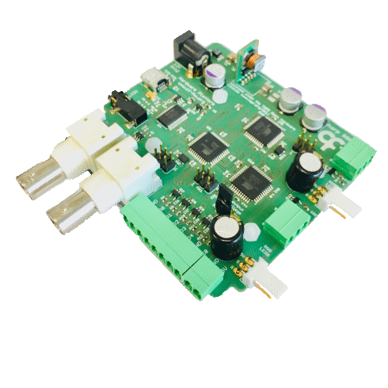

## Harp RGB ##

Controls 2 arrays of colored LEDs according to RGB scale (Up to 32 LED on each array). Each LED has an associated index.

### Key Features ###

* Supports two LED array stripes
* Each stripe can have up to 32 LEDs
* Configurable color and intensity of each LED

### Connectivity ###

* 1x clock sync input (CLKIN) [stereo jack]
* 1x USB (for computer) [USB type C]
* 1x 12V supply [barrel connector jack]
* 1x I/O interface (5x general-purpose digital outputs DO0-DO4, 1x general purpose digital input DI0) [screw terminal]
* 1x digital output (DO0) [BNC]
* 1x digital input (DI0) [BNC]
* 1x Array 0 (G, S, 5V) [flick lock and screw terminal]
* 1x Array 1 (G, S, 5V) [flick lock and screw terminal]

## Interface ##

The interface with the Harp board can be done through [Bonsai](https://bonsai-rx.org/) or a dedicated GUI (Graphical User Interface).

In order to use this GUI, there are some software that needs to be installed:

1 - Install the [drivers](https://bitbucket.org/fchampalimaud/downloads/downloads/UsbDriver-2.12.26.zip).

2 - Install the [runtime](https://bitbucket.org/fchampalimaud/downloads/downloads/Runtime-1.0.zip).

3 - Reboot the computer.

4 - Install the [GUI](https://bitbucket.org/fchampalimaud/downloads/downloads/Harp%20RGB%20Array%20v1.0.0.zip).

## Licensing ##

Each subdirectory will contain a license or, possibly, a set of licenses if it involves both hardware and software.